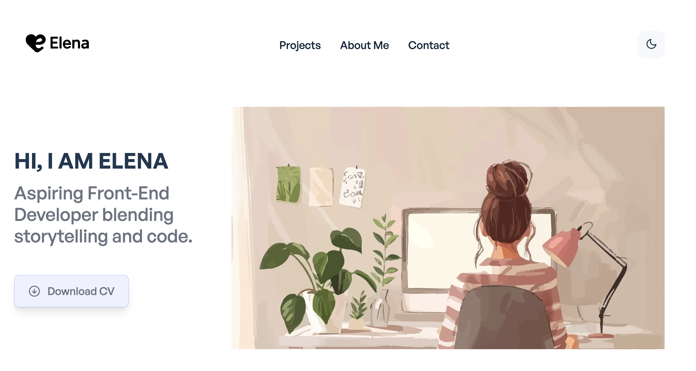

# Elena Chiang — Portfolio Website

🌟 A personal portfolio to showcase my transition from events management into software engineering.

## 🔗 Live Site

👉 [https://elena-portfolio-amber.vercel.app/](https://elena-portfolio-amber.vercel.app/)

## 🎯 About Me

I'm a career switcher currently pursuing an MSc in Computer Science (conversion) at Queen Mary University of London. With 5+ years of experience in event planning and stakeholder coordination, I now bring those skills into software engineering—particularly frontend development and interactive tools.

This site highlights projects that span full-stack development, data analysis, UX design, and productivity applications.

## 🛠️ Tech Stack

- **Frontend:** React, TailwindCSS
- **Routing:** React Router
- **Styling:** Dark Mode, Responsive UI
- **Deployment:** Vercel
- **Other Tools:** localStorage, Charting libs, Figma (for design)

## 📁 Projects Included

| Project                             | Stack                              | Description |
|-------------------------------------|-------------------------------------|-------------|
| **LevelUp** (Final Project)         | React, Django, PostgreSQL           | A gamified productivity app with adaptive task scheduling |
| **COVID-19 Dashboard**              | Python, Pandas, API, Matplotlib     | Real-time data visualization using UKHSA API |
| **Data Analytics Coursework**       | Python, ML, Bayesian Networks       | UK developer industry + attrition analysis |
| **Job Tracker App**                 | React, Tailwind, localStorage       | Track your job search status interactively |
| **To-do List CLI**                  | Python                              | Terminal-based task management tool |
| **Alzheimer’s UI (Figma Demo)**     | Figma                               | A UI prototype focused on accessibility and care workflows |

## 🧭 Folder Structure
/src
/components
/data
/pages
App.jsx
index.css
main.jsx

---

### ⚡ Template Credit

This site was initially adapted from the open-source [React Tailwind Portfolio](https://github.com/realstoman/react-tailwindcss-portfolio) by [Stoman](https://stoman.me), with heavy customisation by Elena Chiang.
